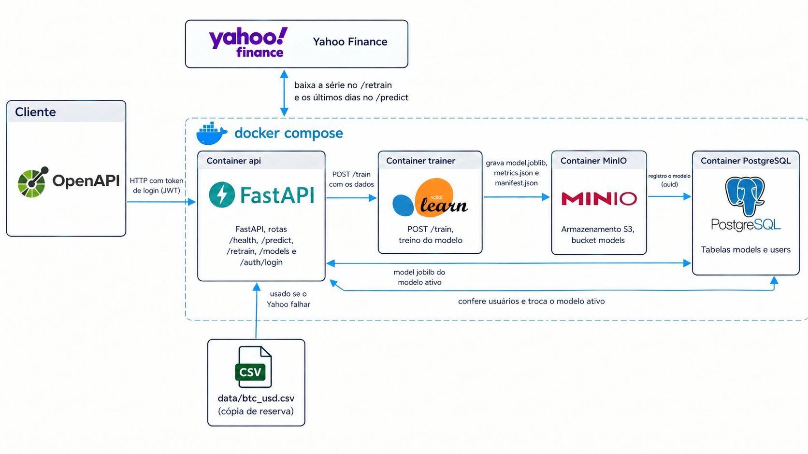
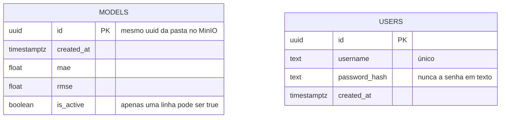
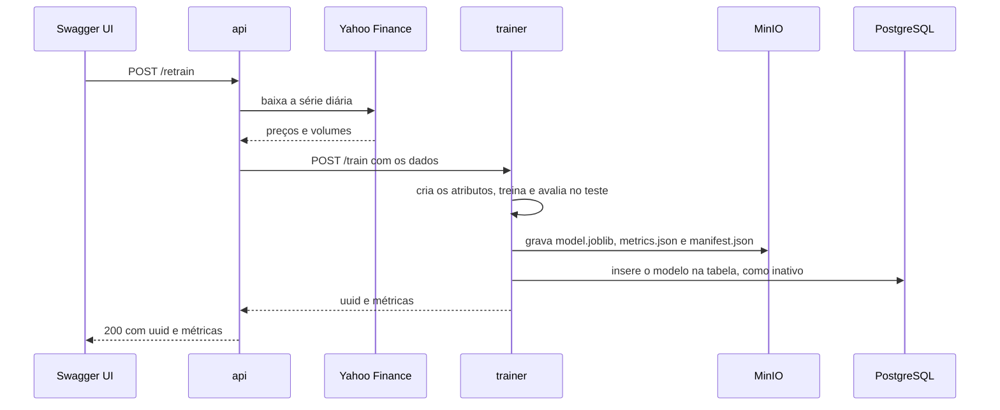
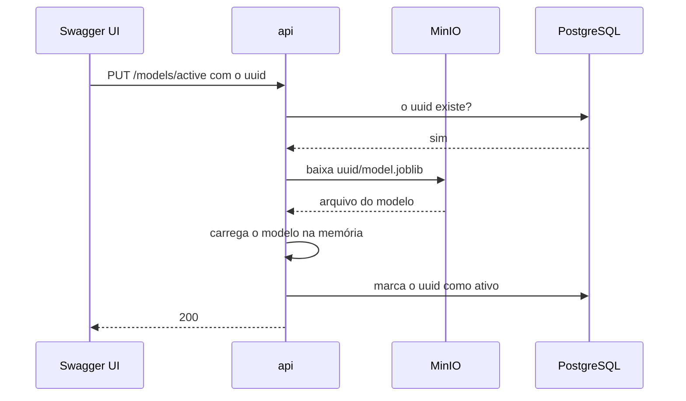
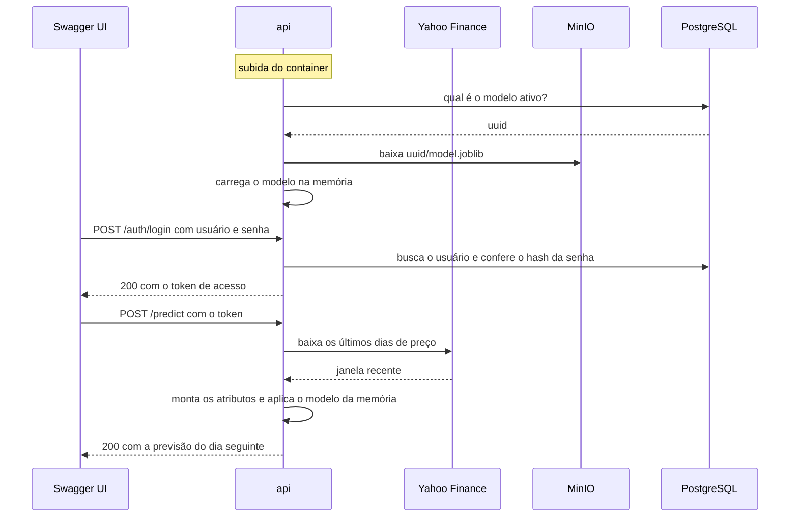
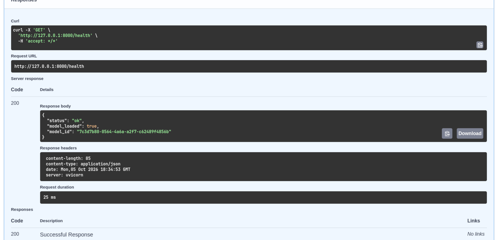
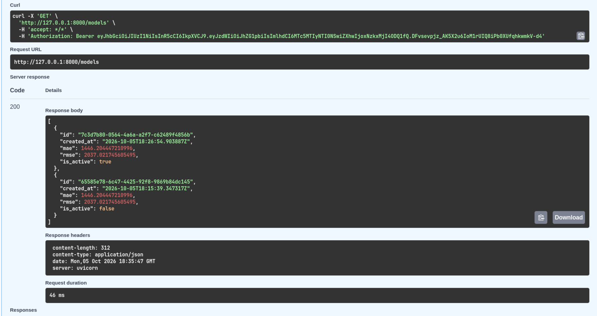
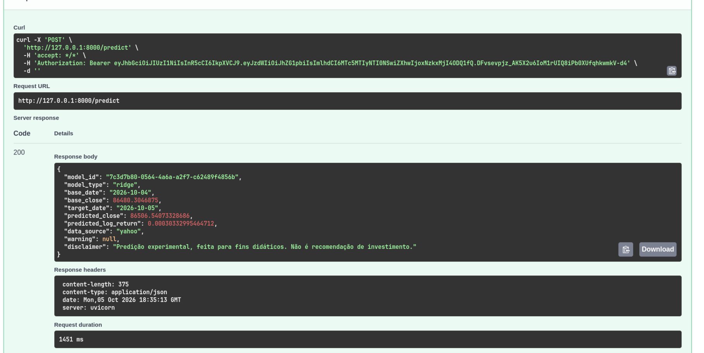
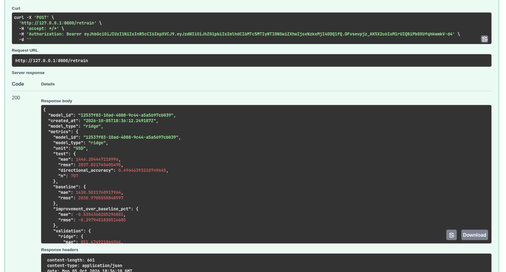

# Atividade-Ponderada-M7-2026-EC

DISCLAIMER: Usei IA para escrever o código e boa parte desse README,não pedi simplismente para a IA fazer tomar as decisões e fazer tudo sozinho,eu dei a ideia do que eu queria e a IA me ajudou a implementar.Para escrever o README,primeiramente crie um texto  com tudo que eu passei,sem me precoupar com ortografia e coerência,depois mandei a IA revisar e ajustar com base naquele  texto que eu fiz,por isso que o texto pode ter ficado com cara IA,até porque foi ela que escreveu com base no que eu disse para ela escrever :) .

## Como executar

Precisa de Docker com o plugin Compose, de internet (Yahoo Finance e download das imagens) e de um usuário que esteja no grupo `docker`.

```bash
cp .env.example .env
docker compose up -d --build
```

Antes de subir, troque as senhas no `.env`. O `JWT_SECRET` precisa ter pelo menos 32 caracteres, e dá para gerar um com `openssl rand -hex 32`. O `.env` não vai para o git.

Os testes são feitos pelo Swagger, em http://127.0.0.1:8000/docs. Clique em Authorize e entre com o `ADMIN_USER` e o `ADMIN_PASSWORD` do `.env`. Numa instalação nova ainda não existe modelo, então o primeiro passo é chamar o `POST /retrain`. O primeiro modelo treinado vira o ativo sozinho, e aí já dá para usar o `POST /predict`. Para apagar tudo e começar do zero, use `docker compose down -v`.

O CSV de reserva pode ser refeito com `python data/fetch_data.py` (precisa de `yfinance` e `pandas`).

## Devlog

### 2026-10-05 14:14 - Começo e escopo


Escolhi prever o fechamento do dia seguinte do BTC-USD, com dados diários do Yahoo Finance pegos pela biblioteca `yfinance`, de 2017-01-01 até hoje. Comecei em 2017 porque nos primeiros anos o Bitcoin tinha pouca liquidez e os preços se comportavam de um jeito bem diferente do atual. Uso só data, fechamento e volume, como o enunciado sugere. O CSV fica salvo em `data/` como reserva, para o sistema continuar funcionando se o Yahoo cair e para qualquer pessoa conseguir reproduzir o treino com os mesmos dados.

Separei treino e teste em ordem cronológica, 80% mais antigos para treinar e 20% mais recentes para testar, sem embaralhar, para o modelo não ver o futuro durante o treino. O modelo é um regressor do scikit-learn com atributos de defasagem. Para saber se ele presta, comparo com um baseline bem simples, que diz que o preço de amanhã é igual ao de hoje, usando MAE e RMSE em dólares, que são fáceis de interpretar. Já sabia que o preço de criptomoedas é muito ruidoso, então não esperava um ganho grande sobre o baseline.

### 2026-10-05 14:31 - Arquitetura

Para essa parte usei como referência a arquitetura que implementei no projeto da Motiva. Meu primeiro desenho era mais simples: um container de treino gravava o `model.joblib` em um volume do Docker e o container do backend lia esse volume quando subia. Funcionava para a demonstração, mas um novo treino exigia derrubar e subir tudo de novo, e não havia como guardar vários modelos nem voltar para um anterior. Por isso mudei para quatro containers: `api` (FastAPI), `trainer` (serviço HTTP com `POST /train`), MinIO e PostgreSQL.

Cada treino grava no MinIO uma pasta com o uuid do modelo, com três arquivos: o `model.joblib`, um `metrics.json` com as métricas do modelo e do baseline e um `manifest.json` com a data, os atributos, o período dos dados e as versões das bibliotecas. Guardei o manifesto ao lado do modelo para conseguir entender depois de onde ele veio sem precisar do banco. No PostgreSQL ficam a tabela `models` (uuid, métricas e qual está ativo) e a tabela `users`, do login. Um índice único parcial garante no próprio banco que só um modelo fica ativo, em vez de confiar só no código.



Fiz o `trainer` como um serviço HTTP, e não como um container que roda uma vez, para o `/retrain` conseguir chamá-lo sem a `api` precisar de acesso ao Docker. Dar o socket do Docker para o backend seria um risco de segurança desnecessário. O `trainer` treina, grava os três arquivos no MinIO e registra o modelo como inativo. Quem ativa é a `api`. Na troca de modelo (`PUT /models/active`) ela primeiro baixa o arquivo do MinIO, carrega na memória e só depois marca como ativo no banco, assim, se der erro no meio, o modelo anterior continua valendo. O modelo chega ao container de inferência desse jeito: a `api` baixa o `model.joblib` do MinIO quando sobe e a cada troca.









### 2026-10-05 14:38 - Dados do Yahoo e autenticação

Decidi que o `/predict` não recebe nada do cliente. Como o modelo usa atributos de defasagem, alguém precisa fornecer os últimos preços, e preferi que a própria `api` busque os últimos dias no Yahoo Finance a cada pedido. Assim quem testa só precisa clicar em executar. O `/retrain` baixa a série completa para treinar com dados atualizados. Se o Yahoo falhar, a `api` usa o CSV do repositório e avisa isso no campo `data_source` da resposta.

Na autenticação, minha primeira ideia era uma chave fixa num cabeçalho. Troquei por um login de verdade: a tabela `users` guarda o hash da senha (bcrypt) e o `POST /auth/login` devolve um token JWT com validade curta. Todas as rotas, menos o `/health` e o login, pedem o token. Não fiz rota de cadastro, porque qualquer pessoa que alcançasse a porta poderia criar uma conta e chamar o `/retrain`. O primeiro usuário é criado na subida, com os dados do `.env`. Só a porta da `api` fica aberta, e apenas em `127.0.0.1`. O `trainer` e o PostgreSQL só são acessíveis pela rede interna do compose.

### 2026-10-05 14:50 - Dados

Escrevi o `data/fetch_data.py`, que baixa o BTC-USD pelo `yfinance` e salva `data/btc_usd.csv` com data, fechamento e volume. Deixei o script no repositório para o CSV poder ser refeito. Baixei 3565 linhas diárias, de 2017-01-01 a 2026-10-05, e conferi a série: datas em ordem e sem repetição, nenhum dia faltando, nenhum valor nulo, nenhum fechamento zerado e nenhum volume zero. A última linha é o dia de hoje, que ainda estava em andamento, e isso virou um cuidado no treino, descrito mais abaixo.

### 2026-10-05 14:57 - MinIO e PostgreSQL no compose

Montei o `docker-compose.yml` com o PostgreSQL e o MinIO. As senhas e o segredo do JWT ficam no `.env`, que não vai para o git (o repositório tem só o `.env.example`, com valores de mentira), e gerei os valores do meu `.env` de forma aleatória. O arquivo `db/init.sql` cria as tabelas `models` e `users` e o índice único parcial na primeira subida do banco. Um serviço `minio-init` cria o bucket `models`, e os dois serviços têm healthcheck, para os outros só subirem quando eles estiverem prontos.

### 2026-10-05 15:00 - Problema: o Docker negou acesso

Quando tentei subir o compose pela primeira vez, o Docker respondeu `permission denied while trying to connect to the docker API at unix:///var/run/docker.sock`. Meu usuário não estava no grupo `docker`, e isso aconteceu porque eu tinha formatado o computador há pouco tempo e esqueci de refazer essa configuração do Docker. Adicionei o usuário ao grupo, mas o `id` nos terminais que já estavam abertos continuou sem o grupo, porque o Linux só atualiza os grupos quando começa uma sessão nova. Fechar o terminal não resolveu e eu tive que reiniciar o computador para o Docker funcionar. Dá para evitar o reinício abrindo um shell novo com `newgrp docker`.

### 2026-10-05 15:08 - Problema: o MinIO saiu do Docker Hub

Com o Docker funcionando, o `docker compose up` falhou ao baixar as imagens do MinIO: `pull access denied for minio/mc, repository does not exist`. Primeiro achei que o erro era nas tags, que eu tinha escrito de memória. Mas tentei `minio/minio` e `minio/mc` no Docker Hub e também no Quay, e nenhuma funcionou. Pesquisei e descobri que o projeto arquivou a edição comunitária e tirou as imagens oficiais dos dois lugares.

Queria continuar com o MinIO, então procurei uma alternativa compatível. Achei o `pgsty/minio`, um fork da comunidade que usa o mesmo binário `minio` e as mesmas variáveis de ambiente, e conferi dentro da imagem que ela já vem com o `mc` e o `curl`. Por isso usei a mesma imagem para o servidor, para criar o bucket (serviço `minio-init`) e para o healthcheck, e fixei a tag `RELEASE.2026-08-04T00-00-00Z`. Depois disso testei a infraestrutura: o PostgreSQL e o MinIO ficaram saudáveis, o bucket `models` foi criado, as duas tabelas existem e o índice único parcial funciona, porque inseri dois modelos ativos de teste e o segundo foi rejeitado (depois apaguei os registros de teste). O ponto negativo é depender de uma imagem mantida por terceiros, e por isso coloquei isso nas limitações.

### 2026-10-05 15:15 - Treino e resultado

Os atributos são calculados a partir do fechamento e do volume: retornos logarítmicos de hoje e de alguns dias atrás, média e desvio dos retornos em 7 e 30 dias, a distância do preço para as médias móveis de 7 e 30 dias e o volume em relação à média recente. O alvo é o retorno logarítmico do dia seguinte, e a previsão de preço é o fechamento de hoje multiplicado por `exp(retorno previsto)`. Escolhi prever o retorno, e não o preço, porque o Bitcoin foi de uns mil dólares para mais de oitenta mil, e um modelo que vê o preço bruto aprende muito mais o nível do que o movimento.

O Yahoo devolve o candle do dia de hoje ainda em andamento, com fechamento e volume parciais, então o `trainer` descarta o dia corrente antes de treinar. O código dos atributos ficou num pacote compartilhado (`common/btc_common`), copiado para as duas imagens, para o treino e a previsão fazerem exatamente as mesmas contas. Por causa disso o contexto de build do Docker é a raiz do repositório.

O treino compara o `ridge` com o `hist_gradient_boosting` e fica com o que erra menos na validação (os últimos 20% do treino). Depois treina de novo o escolhido só com os dados de treino, para as métricas valerem para o modelo que realmente é salvo. O `trainer` grava os três arquivos no MinIO antes de registrar no banco e, se alguma etapa falhar, apaga o que já tinha gravado, para não sobrar modelo pela metade. Como a porta do `trainer` não é publicada, testei mandando o CSV para ele de dentro do próprio container.

Quem ganhou foi o `ridge`. No teste, com 707 dias (de 2024-10-27 a 2026-10-03), deu MAE de 1446,20 e RMSE de 2037,02 dólares, contra 1438,50 e 2030,97 do baseline. Ou seja, o modelo ficou uns 0,5% pior do que simplesmente repetir o preço de hoje, e acertou a direção do movimento em 49,6% dos dias. Não me surpreendeu, porque o retorno diário do Bitcoin é quase ruído e preço e volume sozinhos não explicam o que move o mercado.

### 2026-10-05 15:25 - Experimento: LSTM

Testei uma LSTM para ver se ela achava algum padrão que o `ridge` não achava. Rodei com PyTorch num container temporário, com janelas de 30 dias dos mesmos atributos, uma camada de 32 unidades, parada antecipada pela validação e a mesma divisão de treino e teste, repetindo com 5 sementes diferentes porque o resultado de redes neurais varia de uma execução para outra. A média dos cinco treinos deu MAE de 1451,86 (desvio de 2,73), e a média das previsões deu 1448,60. Nenhuma ficou melhor que o baseline (1438,50) nem que o `ridge` (1446,20), e a acurácia direcional ficou em uns 50%. As previsões de retorno da rede variavam muito menos que os retornos reais, ou seja, ela aprendeu a prever quase sempre um valor perto de zero. Não integrei, porque colocaria o PyTorch na imagem sem melhorar o resultado. Descartei o experimento e não deixei o código dele no repositório.

### 2026-10-05 15:30 - API e OpenAPI

A `api` foi dividida em arquivos pequenos: configuração, acesso ao banco, acesso ao MinIO, segurança (bcrypt e JWT), busca de dados, o registro do modelo ativo e as rotas. A troca de modelo usa um bloqueio para duas trocas não acontecerem ao mesmo tempo, e o `/retrain` ativa o novo modelo sozinho só quando ainda não existe nenhum ativo. No `/predict`, o dia base é o último dia completo e a previsão é para o dia seguinte a ele, e a resposta traz o modelo usado, a origem dos dados e um aviso quando os dados vêm do CSV de reserva ou estão desatualizados.

Primeiro pensei em fazer um cliente de linha de comando, mas como vou testar tudo manualmente, resolvi usar só a página do OpenAPI. Por isso caprichei na documentação do Swagger em `/docs`: rotas agrupadas, descrição e exemplo em cada campo, os erros possíveis de cada rota e o botão Authorize, que guarda o token mesmo se eu recarregar a página. Também troquei a mensagem padrão em inglês de token ausente por uma em português. O FastAPI gera tudo isso a partir do código, então a documentação acompanha a API.

### 2026-10-05 15:35 - Testes

Testei primeiro com `curl` e depois refiz os principais pelo `/docs`. Os comandos para conferir o ambiente foram `docker compose ps`, `docker compose logs` e consultas ao banco com `docker compose exec postgres psql`. Passaram os casos: `/health` sem token; `/models` sem token (401); login com senha errada (401); token inválido (401); `/predict` sem modelo (503); troca para um uuid que não existe (404); troca para um modelo que existe (200), conferindo no banco que só um fica ativo; `/retrain` com um modelo já ativo, que cria o novo como inativo; reinício da `api`, que recarrega sozinha o modelo ativo; e o fallback para o CSV, forçando o `yfinance` a falhar dentro do container. Um detalhe: o `/retrain` devolveu as mesmas métricas do primeiro treino, o que faz sentido, porque os dados do Yahoo eram os mesmos do CSV e o treino não tem aleatoriedade.

`GET /health` com o modelo carregado:



`GET /models`, com os modelos registrados e o ativo:



`POST /predict`, com o fechamento de 2026-10-04 (86480,30) e a previsão para 2026-10-05 (86506,54), usando dados do Yahoo:



`POST /retrain`, treinando um novo modelo e devolvendo as métricas:



## Limitações

O modelo não supera o baseline, e a diferença para o preço de hoje é pequena na previsão de um dia à frente. Os dados vêm de uma única fonte, e o Yahoo precisa de internet. Se ele falhar, a resposta vem do CSV de reserva, que pode estar desatualizado, e por isso avisa. A senha e o token trafegam em HTTP puro, sem TLS, e o login não limita tentativas, o que serve para uma demonstração local, mas seria o primeiro ponto a corrigir fora dela. A imagem do MinIO é de um fork mantido por terceiros. O modelo fica em memória, então a `api` deve rodar com um único processo. E as predições são experimentais, sem nenhum valor como recomendação de investimento.
